

# Las Catacumbas de Supai

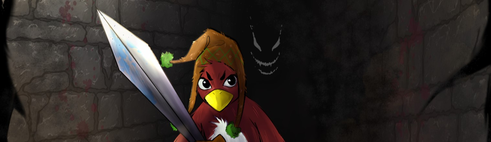

## Acerca del Juego

**Las Catacumbas de Supai** es un juego de plataformas desarrollado como proyecto final para el programa *GameLab de Endless Studio*, organizado por la *Universidad Tecnológica del Perú (UTP)*. 

### Premisa del Juego
¿Cómo nuestro protagonista, un valiente gallito de las rocas, liberará a su pueblo de la montaña de un malvado Ente que acaba de despertar? Bueno, eso es lo que podremos averiguar en mi pequeño juego “Las Catacumbas de Supai”.

Este minijuego ha sido desarrollado para el programa Endless Studios, organizado por la Universidad Tecnológica del Perú. Su premisa busca rescatar la rica y a menudo olvidada mitología andina, presentándola en forma de videojuego para expandir estas historias y permitir que otros las conozcan y aprecien sus orígenes.

"En las alturas de los Andes peruanos, una valiente ave regional, *Gallito*, armado con una hoja mágica bendecida por los Apus, se aventura en antiguas cavernas con la misión de liberar a su pueblo, condenado por el malvado Supay, quién acaba de despertar con mucha hambre de poder. En su odisea, se enfrenta a criaturas míticas como los mukis, cabezas voladoras y otras entidades de la mitología andina, mientras la hoja mágica lo guía y protege. En su camino, va confiado de que los Apus, las deidades de las montañas, le otorgan su bendición y fuerza.

Con el desafío de superar las mazmorras, Gallito busca encontrar la cámara donde reside el poderoso Supay, quien, sin remordimientos, disfruta de las riquezas robadas al inocente pueblo. En su viaje, Gallito no solo lucha contra enemigos sobrenaturales, sino que también aprende valiosas lecciones sobre la importancia de la naturaleza y el respeto por las tradiciones ancestrales."

Su historia se convierte en una leyenda, destacando la importancia de respetar la tierra y su mitología.

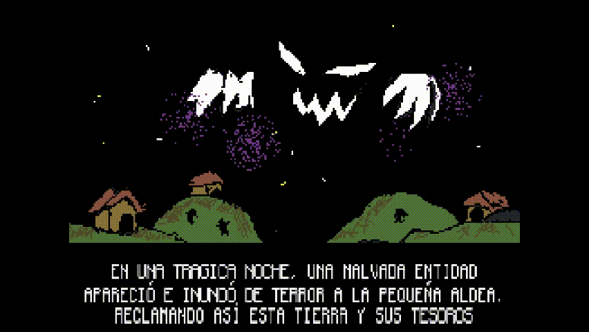

### Personajes

**Rupicola: El gallito de las rocas**
El valiente protagonista de nuestra historia. Armado con una hoja mágica, Rupicola se aventura en las peligrosas catacumbas para salvar a su pueblo.

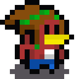

**Supay Muki: El Jefe de los Mukis**
El jefe de las cuevas mineras, este demonio es el más confiable aliado del Supay. Es un enemigo formidable que defiende con fiereza las riquezas robadas.

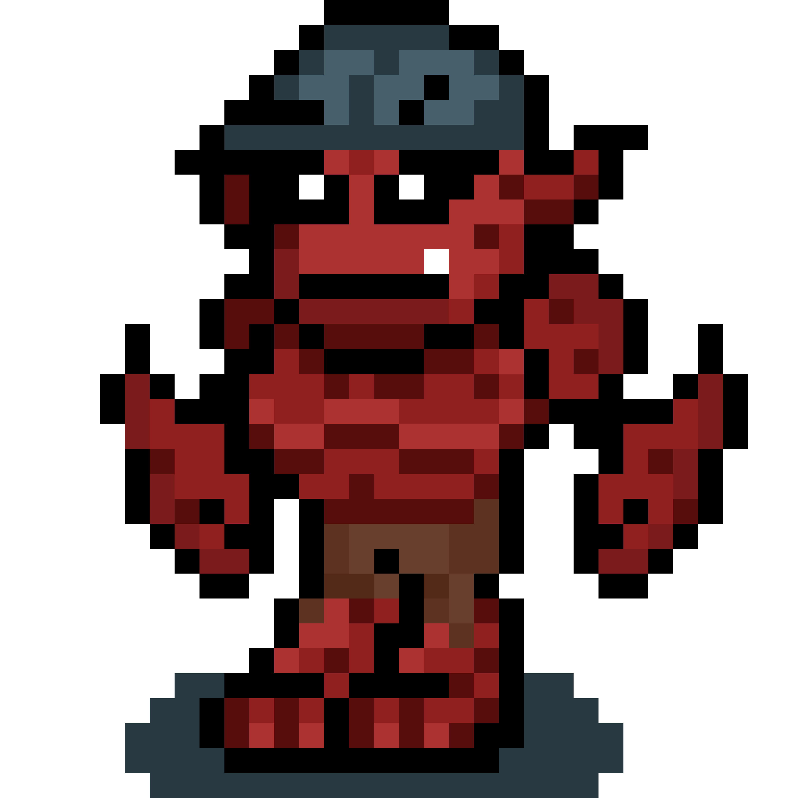

### Diseños

#### Spritesheets

**Rupicola:**
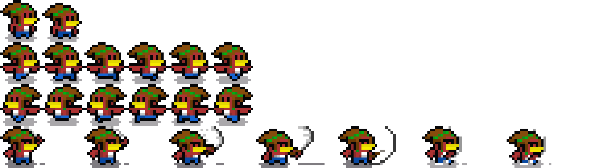

**Supay Muki:**
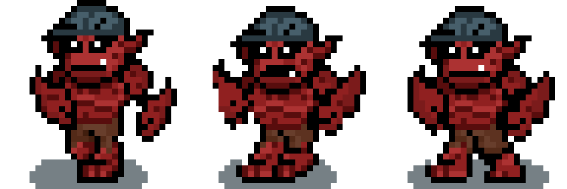

> **Aviso:** Todos los diseños y spritesheets tanto de Gallito como del Supay Muki son de mi autoría. Para el resto de Assets todos los derechos reservados.

### Desarrollo del Juego

El desarrollo de **Las Catacumbas de Supai** fue realizado en **Unity** debido a mi rápida curva de aprendizaje con este motor, lo que me permitió ahorrar tiempo y enfocarme en los detalles del juego. Sin embargo, actualmente, estoy trabajando en un **remake** del juego utilizando **GODOT** y **GDsript** con la intención de expandirlo con nuevas mécanicas y un estilo artístico renovado. Puedes seguir el progreso de este proyecto en el siguiente enlace: [Supay's Gates](https://github.com/Gatorrante/Supay-s-Gates).

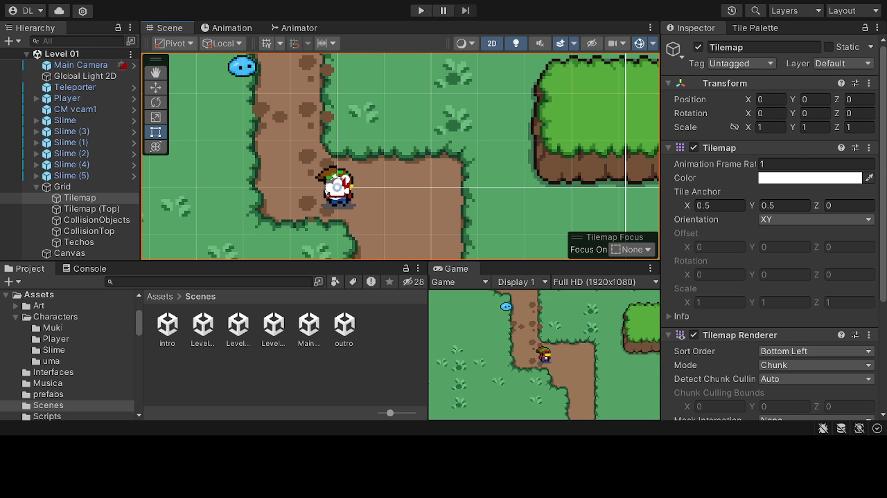

### Desarrollo de Niveles

**Nivel 1: Las Afueras del Pueblo**
En camino a las cavernas del Supay, Gallito recorre las afueras de su pueblo, enfrentándose a los primeros peligros en su viaje.

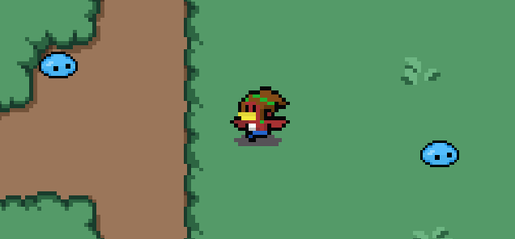

**Nivel 2: Las Mazmorras Mineras**
Un laberinto lleno de ojos voladores, representaciones de la UMA, criaturas que en la mitología andina son cabezas voladoras.

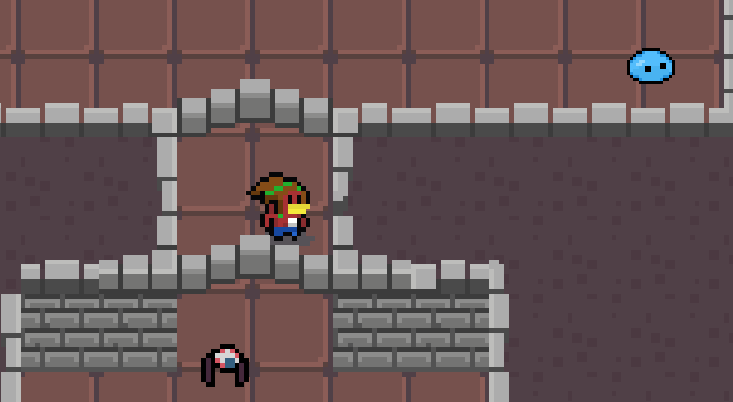

**Nivel 3: El Calabozo del Supay Muki**
El último nivel donde Gallito se enfrenta al Supay Muki, el guardián de las riquezas robadas y la mano derecha del Supay.

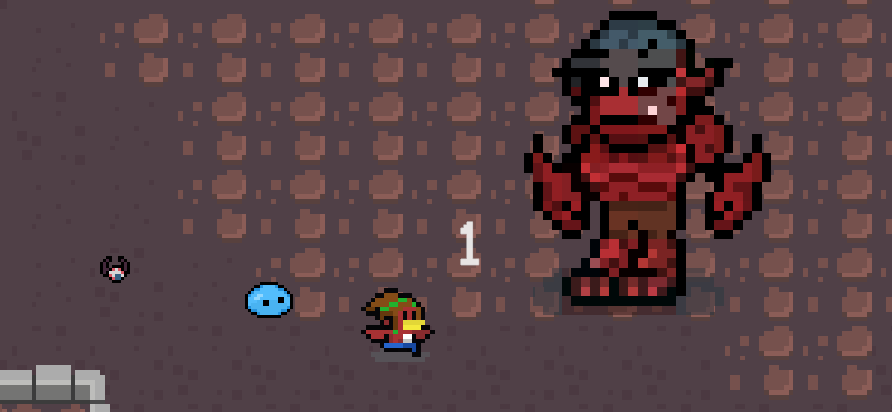

### Arte Conceptual

El arte conceptual jugó un papel crucial en el desarrollo de **Las Catacumbas de Supai**. Aquí puedes ver algunos de los bocetos y diseños que inspiraron el juego final:

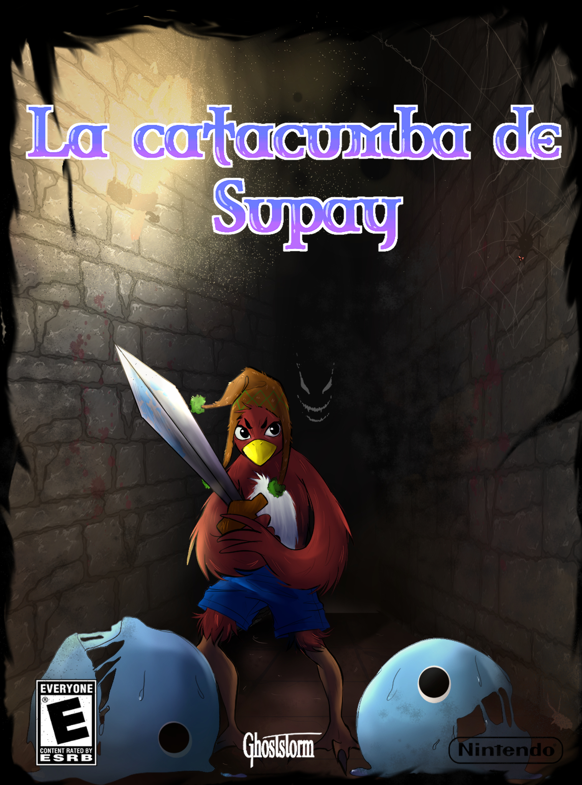

### Créditos

Agradecimientos especiales a [@Bazgart22](https://x.com/Bazgart22) por su apoyo e inspiración en el arte conceptual.
Agradecimientos a Sebas, Ismael y Nayeli quienes me acompañaron en el proceso creativo del juego a pesar de las dificultades y el tiempo.

### EPrueba el juego!
- **Juega en Itch.io:** [Las Catacumbas de Supai en Itch.io](https://gatorrante.itch.io/supai)

### Tecnologías Utilizadas

---

Espero que disfrutes tanto jugando como yo disfruté desarrollando este proyecto. ¡Gracias por jugar **Las Catacumbas de Supai**!
